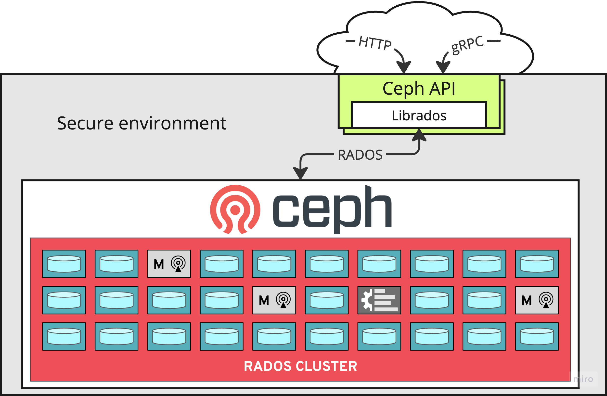

[](https://github.com/seaphony/ceph-api/actions/workflows/test.yml)

[](https://pkg.go.dev/github.com/seaphony/ceph-api?tab=doc)
[](https://goreportcard.com/report/github.com/seaphony/ceph-api)


# Ceph API


Standalone Ceph-API service. Alternative to [Ceph mgr RESTful API](https://docs.ceph.com/en/latest/mgr/ceph_api/).
Exposes REST and gRPC APIs to administrate Ceph cluster. 

[Openapi spec](https://petstore.swagger.io/?url=https://raw.githubusercontent.com/seaphony/ceph-api/main/api/openapi/ceph-api.swagger.json) 
and corresponding `.proto` files for gRPC API located in [`api/`](./api/) directory.

Ceph API requires following RADOS credentials to connect to Ceph cluster:
- rados user (admin)
- rados keyring
- mon host

In this way Ceph API could be deployed anywhere with access to Ceph `mon`.


## Quickstart

1. Start Ceph cluster and API with docker-compose:
    ```shell
    docker-compose up
    ```
    The command above starts Ceph cluster in a single [demo container](https://github.com/ceph/ceph-container/tree/main/src/demo) with (mgr,mon,osd,rgw daemons).
    By default, it is using **ARM** image. For other platforms (x86-64) please adjust `quay.io/ceph/demo` image tag in [`docker-compose.yaml`](./docker-compose.yaml). This can be done with `CEPH_DEMO_TAG` envar:
    ```shell
    CEPH_DEMO_TAG=latest docker-compose up
    ```

    Ceph-API docker container starts with both REST and grpc APIs on port `:9969` and creates default admin account with both username `admin` and password `yoursecretpass`.

2. Get API Access token:
    ```shell
    curl -X POST -u "ceph-api:yoursecretpass" \
    -d "grant_type=password&username=admin&password=yoursecretpass" \
    http://localhost:9969/api/oauth/token
    ```
    where `ceph-api` is OAuth2.0 ClientID (can be found and changed in config).

3. Copy `access_token` from response and use it to call cluster status API endpoint:
    ```shell
    curl -X GET -k "http://localhost:9969/api/cluster" \
    -H "Content-Type: application/json" \
    -H  "Authorization: Bearer <paste access_token here>"
    ```
    In case of success there should be following output:
    ```json
    {"status":"POST_INSTALLED"}
    ```

4. Stop service:
    ```yaml
    docker-compose  down -v
    ```


## Config

By default, both gRPC and REST API are exposed on the same port `:9969`. See all default configurations in [`pkg/config/config.yaml`](./pkg/config/config.yaml).
To override default configuration, create similar YAML file and provide its path to application binary as `-config` or `-config-override` arguments. The latter will override the former and can be useful to manage secret values (mount k8s secret to this path).

Additionally, any config parameter can be set with envar in following format: 
`CFG_<yaml properties seprated with _>=<value>`. For example:
```yaml
app:
  adminPassword: "secret"
# Equals to following envar declaration:
# CFG_APP_ADMINPASSWORD=secret 
```
API config uses the following precedence order:
1. Default [`config.yaml`](./pkg/config/config.yaml)
2. YAML file provided in `-config` 
3. YAML file provided in `-config-override` 
4. Envars


## Security

Ceph API implements Fine-Grained permissions. Permission model was taken from original Ceph API. 
Each API user can have `READ`, `CREATE`, `UPDATE`, `DELETE` permission to Ceph resouce group (pool, osd, monitor, etc.). See full permission list in [system_roles.go](./pkg/user/system_roles.go). API contains Auth2.0 identity provider implemented with [ory/fosite library](https://github.com/ory/fosite) and provides following OAuth2.0 endpoints:
- `POST <base_url>:<httpPort>/api/oauth/token` 
- `POST <base_url>:<httpPort>/api/oauth/auth` 
- `POST <base_url>:<httpPort>/api/oauth/revoke`
- `POST <base_url>:<httpPort>/api/oauth/introspect`

API authenticaiton usage can be found in [test/auth_test.go](./test/auth_test.go). But in general, client authentication can be handled by any client http/gRPC library supporting OAuth2.0.

There is alternative auth API under `/api/auth` path (see [open api](./api/openapi/ceph-api.swagger.json)). This API is **not** implementing OAuth spec and exists for backwards compatibility with old Ceph API. This old api also does not have refresh token feature.


## Clients

There is Go client bindings for gRPC API: [go_api_client.go](./go_api_client.go). Grpcs clients for other languages can be generate from proto files.

## Deploy

Ceph-API Helm chart is located in [deploy/ceph-api/](./deploy/ceph-api/). Each release publishes [docker image](https://github.com/seaphony/ceph-api/pkgs/container/ceph-api) and chart to GitHub registry.
Use the following command to install it from GitHub OCI registry:

```shell
helm install myrelease oci://ghcr.io/seaphony/ceph-api/charts/ceph-api --version 0.0.1
```

If you are managing Ceph with [Rook](https://github.com/rook/rook), you can use these helpers to obtain RADOS credentials ([yq](https://github.com/mikefarah/yq) and [jq](https://github.com/jqlang/jq) required):

```shell
# get monitor IP from Rook ConfigMap:
export MONITOR=$(kubectl -n rook-ceph get cm rook-ceph-mon-endpoints -o yaml | yq .data.csi-cluster-config-json | tr -d "'" | jq '.[0].monitors.[0]' | tr -d '"')

# get admin keyring from rook secret:
export RADOS_KEYRING=$(kubectl -n rook-ceph get secret rook-ceph-mon  -o yaml | yq .data.ceph-secret | base64 --decode)

# install ceph-api with Helm:
helm install myrelease oci://ghcr.io/seaphony/ceph-api/charts/ceph-api --version 0.0.1 --set-json='secretConfig.app={"adminUsername":"admin","adminPassword":"password"}' --set config.app.createAdmin=true --set secretConfig.rados.userKeyring=$RADOS_KEYRING --set secretConfig.rados.monHost=$MONITOR
```

The script above will deploy Ceph API with user `admin` and password `password`.
 
## Test
Along with unit test project contains e2e test to run against real Ceph cluster.
E2E Tests can be found in [/test/](./test/) directory.

Run tests from docker-compose:
```shell
docker-compose -f docker-compose-test.yaml up --build --exit-code-from api-test

# teardown
docker-compose -f docker-compose-test.yaml down -v
```
Test can be also run locally with `go test ./test/` if there are ceph credentials in `/etc/ceph/` directory.


## Develop on MacOS

Install [Lima](https://github.com/lima-vm/lima) - Linux VM for MacOS:
```shell
brew install lima
```
Create Ceph development VM from [lima-ceph-dev.yaml](./lima-ceph-dev.yaml):
```shell
limactl create --name=ceph ./lima-ceph-dev.yaml
```
VM has preinstalled Go, [Microceph](https://github.com/canonical/microceph), and requred Ceph dev libs.

Start the VM:
```shell
limactl start ceph
```

Now run `limactl shell ceph` to ssh into the VM **or** configure [VSCode Remote-SSH development](https://code.visualstudio.com/docs/remote/ssh):
1. Download VSCode
2. Install `Remote - SSH` extension
3. Open Command palette (`Command+Shift+P`) and type `Remote-SSH: connect to host`
4. Select `+ Add New SSH Host...`
5. Paste output from `limactl show-ssh ceph`
6. Done. Now you have proper Linux Ceph dev env on Macos laptop.


## Develop on linux

Please check [Lima Linux VM init script](./lima-ceph-dev.yaml). It contains all required package installations. Execute it on your Linux machine.


## Ceph HOWTOs

View Ceph monitor logs:
```shell
sudo tail -n 20 -f /var/snap/microceph/common/logs/ceph-mon.lima-ceph.log
```

Use dashboard module:
```shell
ceph mgr module enable dashboard
ceph dashboard create-self-signed-cert

# create admin user with <username>/<password>:
cat <<EOF >pwd.txt
<put admin password here and remove brackets>
EOF
ceph dashboard ac-user-create --enabled --force-password <username> -i pwd.txt administrator

# get access token:
curl -X POST -k "https://localhost:8443/api/auth" \
-H  "Accept: application/vnd.ceph.api.v1.0+json" \
-H  "Content-Type: application/json" \
-d '{"username": "<username>", "password": "<password>"}'

# call dashboard api:
curl -X GET -k "https://localhost:8443/api/cluster" \
-H  "Accept: application/vnd.ceph.api.v0.1+json" \
-H "Content-Type: application/json" \
-H  "Authorization: Bearer <access token>"
```

Use rest module:
```shell
ceph mgr module enable restful
ceph ceph restful create-self-signed-cert
# create api key
ceph restful create-key <username>
# call rest api
curl -k https://<username>:<api key>@localhost:8003/server
```

